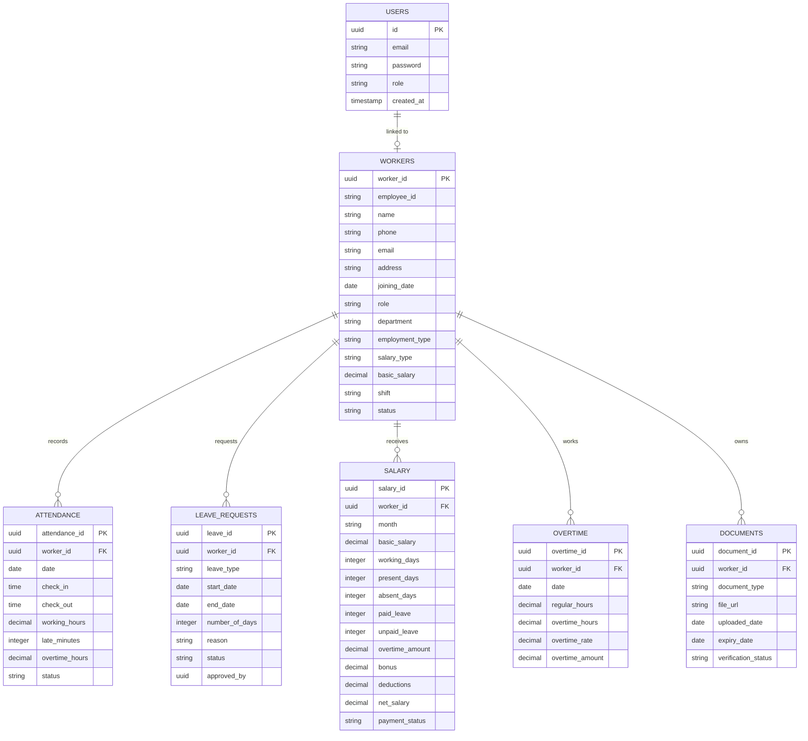

# 🏪 CBR COLLECTIONS

## Smart Workforce Management System

<p align="center">

**A centralized digital workforce platform for managing workers, attendance, leave, payroll, overtime, documents, and workforce analytics.**


</p>

<p align="center">


</p>

---

# 📌 Overview

**CBR COLLECTIONS – Smart Workforce Management System** is a full-stack web application designed for a readymade garments retail business to digitally manage its complete workforce lifecycle.

The system replaces traditional:

* 📒 Paper registers
* 📊 Excel spreadsheets
* 📝 Manual attendance
* 🧮 Manual salary calculations
* 📁 Physical document storage

with a **centralized, secure, role-based workforce management platform**.

The application allows administrators to manage workers, attendance, leave, payroll, overtime, employee documents, reports, and workforce analytics from a single dashboard.

Workers can access their own profile, attendance, leave requests, salary information, overtime records, and payslips through a dedicated worker portal.

---

# 🎯 Project Vision

> **Transform CBR COLLECTIONS from manual workforce administration into a data-driven digital workforce management environment.**

The system is designed not merely as an employee database, but as a complete **Workforce Operations Platform**.

```text
                    CBR COLLECTIONS
                           │
                           ▼
              ┌────────────────────────┐
              │ Smart Workforce System  │
              └────────────┬───────────┘
                           │
       ┌───────────────────┼───────────────────┐
       │                   │                   │
       ▼                   ▼                   ▼
   👥 Workers          🕐 Attendance        🏖️ Leave
       │                   │                   │
       ▼                   ▼                   ▼
   📄 Documents        ⏰ Overtime          💰 Payroll
       │                   │                   │
       └───────────────────┼───────────────────┘
                           ▼
                   📊 Analytics
                           │
                           ▼
                    👨‍💼 Management
```

---

# 🚨 Problem Statement

Traditional retail businesses frequently depend on disconnected methods for workforce administration.

### Existing Challenges

| Problem                     | Impact                    |
| --------------------------- | ------------------------- |
| Manual employee records     | Difficult to maintain     |
| Paper attendance registers  | Human errors              |
| Excel-based payroll         | Calculation mistakes      |
| Manual overtime calculation | Incorrect wage processing |
| Physical documents          | Risk of loss              |
| Separate leave records      | Data inconsistency        |
| No centralized dashboard    | Poor visibility           |
| Manual reporting            | Time-consuming            |
| No workforce analytics      | Difficult decision-making |

### ❌ Traditional Workflow

```text
Paper Register
      │
      ▼
Manual Attendance
      │
      ▼
Excel Sheet
      │
      ▼
Manual Salary Calculation
      │
      ▼
Separate Documents
      │
      ▼
Manual Reports
```

### ✅ Proposed Workflow

```text
              Smart Workforce System
                       │
        ┌──────────────┼──────────────┐
        ▼              ▼              ▼
     Workers       Attendance        Leave
        │              │              │
        └──────────────┼──────────────┘
                       ▼
                  Overtime
                       │
                       ▼
                    Payroll
                       │
                       ▼
                  Payslip
                       │
                       ▼
               Reports & Analytics
```

---

# 🎯 Objectives

The major objectives of the project are:

* 👤 Digitize complete worker profiles
* 🕐 Automate attendance management
* 🏖️ Manage employee leave
* 💰 Simplify monthly payroll
* ⏰ Track overtime
* 📄 Digitally store worker documents
* 📊 Generate workforce analytics
* 📑 Generate reports and payslips
* 🔐 Implement secure role-based access
* 📈 Support data-driven management decisions
* 📱 Provide a foundation for mobile applications
* 🤖 Enable future IoT-based attendance

---

# ✨ Key Features

## 👤 1. Worker Management

Complete employee lifecycle management.

### Worker Information

**Personal Information**

* Worker ID
* Employee ID
* Full Name
* Profile Photo
* Date of Birth
* Gender
* Phone Number
* Email
* Address
* Emergency Contact

**Employment Information**

* Date of Joining
* Job Role
* Department
* Employment Type
* Salary Type
* Basic Salary
* Working Hours
* Shift
* Employment Status

### Worker Status

```text
🟢 ACTIVE
🟡 ON LEAVE
🔴 INACTIVE
⚫ RESIGNED
```

### Example Worker Profile

```text
┌──────────────────────────────────────┐
│           WORKER PROFILE             │
├──────────────────────────────────────┤
│ Worker ID      : CBR-WRK-001         │
│ Employee ID    : EMP-001             │
│ Name           : Ramesh Kumar        │
│ Role           : Sales Assistant     │
│ Department     : Sales               │
│ Joining Date   : 12-Jun-2025         │
│ Salary Type    : Monthly             │
│ Basic Salary   : ₹18,000             │
│ Shift          : 09:30 AM - 06:30 PM │
│ Status         : 🟢 Active           │
└──────────────────────────────────────┘
```

---

# 🕐 2. Attendance Management

The attendance module records and processes daily workforce attendance.

### Attendance Data

* Date
* Check-in
* Check-out
* Working hours
* Late minutes
* Early departure
* Overtime
* Attendance status

### Attendance Status

| Status     | Meaning               |
| ---------- | --------------------- |
| 🟢 Present | Worker attended       |
| 🔴 Absent  | Worker did not attend |
| 🟡 Late    | Worker arrived late   |
| 🔵 Leave   | Approved leave        |
| ⚪ Holiday  | Non-working day       |

### Example

| Worker | Date   | Check-In | Check-Out | Hours  | Status  |
| ------ | ------ | -------- | --------- | ------ | ------- |
| Ramesh | 10-Aug | 09:25 AM | 06:35 PM  | 9h 10m | Present |
| Kumar  | 10-Aug | 10:15 AM | 06:30 PM  | 8h 15m | Late    |
| Arun   | 10-Aug | —        | —         | 0h     | Absent  |

### Attendance Percentage

```text
Attendance Percentage

       Present Days
------------------------- × 100
       Working Days
```

---

# 🏖️ 3. Leave Management

Workers can submit leave requests while administrators can review and manage them.

### Leave Workflow

```text
                 WORKER
                    │
                    ▼
             Submit Request
                    │
          ┌─────────┴─────────┐
          ▼                   ▼
      Leave Date            Reason
          │                   │
          └─────────┬─────────┘
                    ▼
                ADMIN
                    │
          ┌─────────┴─────────┐
          ▼                   ▼
       APPROVE              REJECT
          │
          ▼
 Attendance Updated
```

### Leave Types

* Casual Leave
* Sick Leave
* Emergency Leave
* Paid Leave
* Unpaid Leave
* Other

### Leave Information

```text
Leave ID
Worker ID
Leave Type
Start Date
End Date
Number of Days
Reason
Request Date
Approval Status
Approved By
```

---

# 💰 4. Salary & Payroll Management

The payroll module calculates monthly worker salary based on configurable business rules.

### Payroll Inputs

```text
Basic Salary
      +
Overtime
      +
Bonus
      -
Deductions
      -
Unpaid Leave
      =
Net Salary
```

### Example

```text
Basic Salary       = ₹18,000
Overtime            = ₹1,200
Bonus               = ₹500
Deductions          = ₹300
Unpaid Leave        = ₹600
--------------------------------
Net Salary          = ₹18,800
```

> Payroll rules can be configured according to the actual salary policy followed by CBR COLLECTIONS.

### Payroll Features

* Monthly salary generation
* Worker-wise salary
* Overtime integration
* Bonus management
* Deduction management
* Paid/unpaid leave calculation
* Payment status
* Payslip generation
* Salary history

---

# ⏰ 5. Overtime Management

The system tracks additional working hours automatically.

### Example

```text
Regular Shift

09:30 AM ─────────────────── 06:30 PM


Actual Work

09:30 AM ─────────────────────────────── 08:00 PM
                                      ▲
                                      │
                              1h 30m Overtime
```

### Overtime Calculation

```text
Overtime Hours = 2

Overtime Rate = ₹100/hour

Overtime Pay
= 2 × ₹100
= ₹200
```

### Stored Information

* Overtime ID
* Worker
* Date
* Regular Hours
* Overtime Hours
* Overtime Rate
* Overtime Amount

---

# 📄 6. Worker Document Management

The system provides secure digital document management.

### Supported Documents

```text
Worker
 │
 ├── 🪪 ID Proof
 ├── 🏠 Address Proof
 ├── 🏦 Bank Details
 ├── 📑 Employment Agreement
 ├── 🎓 Qualification Certificate
 ├── 🖼️ Profile Photo
 └── 📁 Other Documents
```

### Document Metadata

* Document ID
* Worker ID
* Document Type
* File
* Upload Date
* Expiry Date
* Verification Status

### Security

Sensitive employee documents are protected using:

* Authentication
* Authorization
* Role-based access
* Secure storage
* Access control
* Audit logs

---

# 📊 7. Workforce Analytics

The analytics module converts workforce records into useful business insights.

## Dashboard

```text
┌────────────────────────────────────────────────────┐
│             CBR COLLECTIONS DASHBOARD               │
├────────────────────────────────────────────────────┤
│                                                    │
│ 👥 Total Workers                  35               │
│ 🟢 Present Today                  31               │
│ 🔴 Absent Today                    2               │
│ 🏖️ On Leave                       2               │
│                                                    │
│ 📊 Attendance Rate                92%              │
│ ⏰ Overtime Hours                 86               │
│ 💰 Monthly Payroll           ₹5,42,000             │
│                                                    │
└────────────────────────────────────────────────────┘
```

### Analytics

The dashboard can provide:

* Daily attendance trends
* Monthly attendance
* Present vs absent
* Department distribution
* Leave distribution
* Overtime trends
* Monthly payroll
* Worker growth
* Late attendance
* Absence patterns

---

# 📈 Reports

The system supports multiple report categories.

## Attendance Reports

* Daily attendance
* Weekly attendance
* Monthly attendance
* Worker-wise attendance
* Department-wise attendance
* Late arrival report
* Absence report

## Payroll Reports

* Monthly payroll
* Worker-wise salary
* Overtime report
* Deduction report
* Bonus report
* Payslips

## Workforce Reports

* Total workers
* Active workers
* Inactive workers
* New employees
* Workers on leave
* Attendance percentage

---

# 👨‍💼 Role-Based Access Control

The system supports two primary roles.

```text
                    AUTHENTICATION
                          │
                ┌─────────┴─────────┐
                ▼                   ▼
             👨‍💼 ADMIN           👷 WORKER
                │                   │
                ▼                   ▼
        Full System Access      Limited Access
```

## Admin

| Feature           | Access |
| ----------------- | ------ |
| Worker Management | ✅      |
| Attendance        | ✅      |
| Leave Approval    | ✅      |
| Payroll           | ✅      |
| Overtime          | ✅      |
| Documents         | ✅      |
| Reports           | ✅      |
| Analytics         | ✅      |
| System Settings   | ✅      |

## Worker

| Feature            | Access  |
| ------------------ | ------- |
| Personal Profile   | ✅       |
| Own Attendance     | ✅       |
| Leave Request      | ✅       |
| Leave Status       | ✅       |
| Own Salary         | ✅       |
| Own Overtime       | ✅       |
| Payslip            | ✅       |
| Personal Documents | Limited |

---

# 🔐 Authentication & Security

Security is a major component of the application.

### Authentication Flow

```text
User
 │
 ▼
Login
 │
 ▼
Authentication API
 │
 ▼
Verify Credentials
 │
 ▼
Generate JWT
 │
 ▼
Role Validation
 │
 ├───────────────┐
 ▼               ▼
ADMIN           WORKER
 │               │
 ▼               ▼
Full Access    Restricted Access
```

### Security Features

* 🔑 Password hashing
* 🎫 JWT authentication
* 🛡️ Role-based authorization
* 🔒 Protected API endpoints
* 🗄️ Database access control
* 📁 Secure document storage
* 📝 Audit logging
* ⏱️ Session management
* 🚫 Unauthorized request protection

---

# 🏗️ System Architecture

```text
                         ┌───────────────────────┐
                         │       USERS           │
                         │                       │
                         │  👨‍💼 Admin   👷 Worker │
                         └───────────┬───────────┘
                                     │
                                     ▼
                         ┌───────────────────────┐
                         │     React Frontend    │
                         │   + Tailwind CSS      │
                         └───────────┬───────────┘
                                     │
                                  HTTPS
                                     │
                                     ▼
                         ┌───────────────────────┐
                         │    Node.js + Express  │
                         │       REST API        │
                         └───────────┬───────────┘
                                     │
                 ┌───────────────────┼───────────────────┐
                 │                   │                   │
                 ▼                   ▼                   ▼
          Authentication        Business Logic       File Storage
                 │                   │                   │
                 ▼                   ▼                   ▼
              JWT/RBAC       Payroll/Attendance      Supabase
                                     │
                                     ▼
                         ┌───────────────────────┐
                         │      PostgreSQL       │
                         │       Database        │
                         └───────────┬───────────┘
                                     │
                                     ▼
                         ┌───────────────────────┐
                         │   Analytics & Reports │
                         └───────────────────────┘
```

---

# 🧩 System Modules

```text
                    CBR COLLECTIONS
                           │
                  ┌────────┴────────┐
                  │ Authentication  │
                  └────────┬────────┘
                           │
          ┌────────────────┼────────────────┐
          │                │                │
          ▼                ▼                ▼
       Workers        Attendance          Leave
          │                │                │
          ▼                ▼                ▼
     Documents         Overtime          Payroll
          │                │                │
          └────────────────┼────────────────┘
                           ▼
                     Analytics
                           │
                           ▼
                       Reports
```

---

# 🗄️ Database Architecture

The application uses a relational database architecture.

### Core Tables

```text
users
  │
  └──────── workers
                │
       ┌────────┼─────────┬──────────┐
       │        │         │          │
       ▼        ▼         ▼          ▼
 attendance   leaves    overtime   documents
                │
                ▼
              salary
```

---

# 🧬 Entity Relationship Diagram



---

# 📋 Database Tables

## `workers`

```text
worker_id
employee_id
name
photo
date_of_birth
gender
phone
email
address
emergency_contact
joining_date
role
department
employment_type
salary_type
basic_salary
shift
status
created_at
updated_at
```

## `attendance`

```text
attendance_id
worker_id
date
check_in
check_out
working_hours
late_minutes
overtime_hours
status
```

## `leave_requests`

```text
leave_id
worker_id
leave_type
start_date
end_date
number_of_days
reason
status
approved_by
created_at
```

## `salary`

```text
salary_id
worker_id
month
basic_salary
working_days
present_days
absent_days
paid_leave
unpaid_leave
overtime_amount
bonus
deductions
net_salary
payment_status
```

## `overtime`

```text
overtime_id
worker_id
date
regular_hours
overtime_hours
overtime_rate
overtime_amount
```

## `documents`

```text
document_id
worker_id
document_type
file_url
uploaded_date
expiry_date
verification_status
```

---

# 🔄 Complete Business Workflow

```text
                     WORKER JOINS
                          │
                          ▼
                  Worker Registration
                          │
                          ▼
                    Profile Created
                          │
                          ▼
                  Daily Attendance
                          │
                 ┌────────┴────────┐
                 ▼                 ▼
              Present             Leave
                 │                 │
                 ▼                 ▼
           Working Hours      Leave Record
                 │
                 ▼
              Overtime
                 │
                 ▼
         Monthly Calculation
                 │
                 ▼
               Payroll
                 │
                 ▼
              Payslip
                 │
                 ▼
         Reports & Analytics
```

---

# 💻 Recommended Technology Stack

## Frontend

| Technology          | Purpose              |
| ------------------- | -------------------- |
| React.js            | UI development       |
| Tailwind CSS        | Styling              |
| React Router        | Navigation           |
| Recharts / Chart.js | Analytics            |
| TanStack Query      | API state management |

## Backend

| Technology | Purpose          |
| ---------- | ---------------- |
| Node.js    | Runtime          |
| Express.js | REST API         |
| JWT        | Authentication   |
| bcrypt     | Password hashing |
| Multer     | File uploads     |

## Database

| Technology         | Purpose                     |
| ------------------ | --------------------------- |
| PostgreSQL         | Relational database         |
| Supabase           | Database / backend services |
| Row Level Security | Data protection             |

## Storage

```text
Supabase Storage
       │
       ├── Profile Photos
       ├── ID Proofs
       ├── Certificates
       ├── Agreements
       └── Other Documents
```

---

# 📁 Recommended Project Structure

```text
cbr-collections/
│
├── frontend/
│   ├── src/
│   │   ├── components/
│   │   ├── pages/
│   │   ├── layouts/
│   │   ├── hooks/
│   │   ├── services/
│   │   ├── utils/
│   │   ├── context/
│   │   └── App.jsx
│   │
│   ├── public/
│   └── package.json
│
├── backend/
│   ├── controllers/
│   ├── routes/
│   ├── models/
│   ├── middleware/
│   ├── services/
│   ├── utils/
│   ├── config/
│   ├── uploads/
│   └── server.js
│
├── database/
│   ├── schema.sql
│   ├── migrations/
│   └── seed.sql
│
├── docs/
│   ├── architecture/
│   ├── api/
│   └── screenshots/
│
├── .env.example
├── .gitignore
└── README.md
```

---

# 🔌 API Architecture

The backend follows a RESTful API architecture.

## Authentication

```text
POST   /api/auth/login
POST   /api/auth/register
POST   /api/auth/logout
GET    /api/auth/me
```

## Workers

```text
GET    /api/workers
GET    /api/workers/:id
POST   /api/workers
PUT    /api/workers/:id
DELETE /api/workers/:id
```

## Attendance

```text
GET    /api/attendance
POST   /api/attendance/check-in
POST   /api/attendance/check-out
GET    /api/attendance/:workerId
```

## Leave

```text
GET    /api/leaves
POST   /api/leaves
PUT    /api/leaves/:id/approve
PUT    /api/leaves/:id/reject
```

## Payroll

```text
GET    /api/payroll
POST   /api/payroll/generate
GET    /api/payroll/:workerId
GET    /api/payroll/:id/payslip
```

## Overtime

```text
GET    /api/overtime
POST   /api/overtime
PUT    /api/overtime/:id
DELETE /api/overtime/:id
```

## Documents

```text
GET    /api/documents/:workerId
POST   /api/documents/upload
DELETE /api/documents/:id
```

## Analytics

```text
GET    /api/analytics/dashboard
GET    /api/analytics/attendance
GET    /api/analytics/payroll
GET    /api/analytics/overtime
GET    /api/analytics/leave
```

---

# 🖥️ Application Screens

The final application can contain the following interfaces:

### 👨‍💼 Admin

```text
┌─────────────────────────────────────────┐
│ CBR COLLECTIONS                         │
├───────────────┬─────────────────────────┤
│ Dashboard     │                         │
│ Workers       │      Dashboard          │
│ Attendance    │                         │
│ Leave         │   👥 35 Workers        │
│ Payroll       │   🟢 31 Present        │
│ Overtime      │   🔴 2 Absent          │
│ Documents     │   🏖️ 2 Leave           │
│ Reports       │                         │
│ Analytics     │   📊 Attendance 92%     │
│ Settings      │   💰 Payroll ₹5.42L     │
└───────────────┴─────────────────────────┘
```

### 👷 Worker

```text
┌─────────────────────────────────────────┐
│          WORKER DASHBOARD               │
├─────────────────────────────────────────┤
│                                         │
│ 👤 My Profile                           │
│                                         │
│ 🕐 Today's Attendance                   │
│                                         │
│ 🏖️ Request Leave                       │
│                                         │
│ 💰 Salary                               │
│                                         │
│ ⏰ Overtime                             │
│                                         │
│ 📄 Documents                            │
│                                         │
│ 📑 Download Payslip                     │
│                                         │
└─────────────────────────────────────────┘
```

---

# 🖼️ Screenshots

Add your actual project screenshots inside:

```text
docs/screenshots/
```

Recommended screenshots:

```text
docs/
└── screenshots/
    ├── login.png
    ├── admin-dashboard.png
    ├── worker-list.png
    ├── worker-profile.png
    ├── attendance.png
    ├── leave-management.png
    ├── payroll.png
    ├── overtime.png
    ├── documents.png
    ├── analytics.png
    └── worker-dashboard.png
```

Then display them in this section:

### 🔐 Login

```md

```

### 📊 Admin Dashboard

```md

```

### 👤 Worker Management

```md

```

### 🕐 Attendance

```md

```

### 💰 Payroll

```md

```

### 📈 Analytics

```md

```

> Replace these paths with your actual screenshots after completing the UI.

---

# 📊 Analytics Dashboard Concept

The dashboard can contain multiple visualizations.

```text
┌─────────────────────────────────────────────────┐
│              WORKFORCE ANALYTICS                │
├──────────────────────┬──────────────────────────┤
│                      │                          │
│ Attendance Trend 📈  │ Present vs Absent 📊    │
│                      │                          │
├──────────────────────┼──────────────────────────┤
│                      │                          │
│ Payroll Trend 💰     │ Leave Distribution 🥧   │
│                      │                          │
├──────────────────────┴──────────────────────────┤
│                                                │
│             Overtime Hours 📊                  │
│                                                │
└─────────────────────────────────────────────────┘
```

---

# 📱 Future Mobile Application

A Flutter-based worker application can be developed as an extension.

```text
                    WORKER APP
                        │
             ┌──────────┼──────────┐
             ▼          ▼          ▼
          Profile   Attendance    Leave
             │          │          │
             └──────────┼──────────┘
                        ▼
                     Salary
                        │
                        ▼
                    Overtime
                        │
                        ▼
                    Payslips
                        │
                        ▼
                   Notifications
```
Possible notification channels:

* Email
* Push notification
* In-app notification
* SMS
* WhatsApp integration — future enhancement

---

# 🤖 Advanced IoT Attendance

One of the major future upgrades is **automated attendance using IoT**.

## QR-Based Attendance

```text
Worker
  │
  ▼
Unique QR Code
  │
  ▼
QR Scanner
  │
  ▼
Worker Identification
  │
  ▼
Backend API
  │
  ▼
Attendance Database
  │
  ▼
Dashboard Updated
```

## RFID + ESP32

A hardware-based implementation can make the system more innovative.

```text
RFID Card
    │
    ▼
RFID Reader
    │
    ▼
ESP32
    │
    ▼
Wi-Fi
    │
    ▼
REST API
    │
    ▼
PostgreSQL
    │
    ▼
Attendance Updated
```

### Possible Hardware

* ESP32
* RFID RC522
* RFID Cards
* OLED Display
* Buzzer
* LED indicators
* Wi-Fi

This extension can convert the project from a conventional web application into a **Full-Stack + IoT Workforce Management System**.

---

# 🧠 Intelligent Workforce Analytics — Future Scope

The system can later introduce AI-based analytics.

### Possible AI Features

```text
Historical Attendance
        │
        ▼
Machine Learning Model
        │
        ├── Attendance Prediction
        │
        ├── Absence Pattern Detection
        │
        ├── Overtime Trend Analysis
        │
        ├── Workforce Requirement
        │
        └── Anomaly Detection
```

### Example

> "The Sales Department has shown a 14% increase in late arrivals during the last three months."

The system could automatically identify such trends from historical data.

---


## Scalability

The architecture should support expansion from:

```text
35 Workers
     ↓
100 Workers
     ↓
500 Workers
     ↓
Multiple Branches
```

---

# 📈 Scalability Roadmap

```text
PHASE 1
Web Workforce Management
        │
        ▼
PHASE 2
QR Attendance
        │
        ▼
PHASE 3
RFID + ESP32
        │
        ▼
PHASE 4
Flutter Worker App
        │
        ▼
PHASE 5
AI Workforce Analytics
        │
        ▼
PHASE 6
Multi-Branch Management
        │
        ▼
PHASE 7
Cloud-Based Workforce Platform
```

---
# ⚙️ Installation

## 1. Clone Repository

```bash
git clone https://github.com/YOUR_USERNAME/cbr-collections.git
cd cbr-collections
```

## 2. Install Frontend

```bash
cd frontend
npm install
```

## 3. Install Backend

```bash
cd ../backend
npm install
```

## 4. Configure Environment Variables

Create:

```text
backend/.env
```

Example:

```env
PORT=5000

DATABASE_URL=your_postgresql_connection_string

JWT_SECRET=your_secure_jwt_secret

SUPABASE_URL=your_supabase_url
SUPABASE_KEY=your_supabase_key
SUPABASE_BUCKET=worker-documents
```

## 5. Start Backend

```bash
npm run dev
```

## 6. Start Frontend

```bash
cd ../frontend
npm run dev
```

---


# 💡 Example Payroll Algorithm

```text
INPUT

Basic Salary
Working Days
Present Days
Paid Leave
Unpaid Leave
Overtime
Bonus
Deductions

        │
        ▼

Calculate Attendance Pay
        │
        ▼
Calculate Overtime
        │
        ▼
Add Bonus
        │
        ▼
Subtract Deductions
        │
        ▼
Subtract Unpaid Leave
        │
        ▼
Generate Net Salary
        │
        ▼
Generate Payslip
```

---

# 📑 Sample Payslip

```text
╔════════════════════════════════════════════╗
║             CBR COLLECTIONS                ║
║                 PAYSLIP                    ║
╠════════════════════════════════════════════╣
║ Employee ID : EMP-001                      ║
║ Employee    : Ramesh Kumar                 ║
║ Month       : August 2026                  ║
╠════════════════════════════════════════════╣
║ Basic Salary             ₹18,000           ║
║ Overtime                 ₹1,200            ║
║ Bonus                    ₹500              ║
║ Deductions              -₹300              ║
║ Unpaid Leave            -₹600              ║
╠════════════════════════════════════════════╣
║ NET SALARY               ₹18,800           ║
╠════════════════════════════════════════════╣
║ Payment Status           PAID              ║
╚════════════════════════════════════════════╝
```

---

# 🌟 Why This Project Is Different

CBR COLLECTIONS is more than a basic CRUD application.

It combines:

```text
             ┌─────────────────────┐
             │ Workforce Management│
             └──────────┬──────────┘
                        │
        ┌───────────────┼────────────────┐
        ▼               ▼                ▼
      CRUD           Automation        Analytics
        │               │                │
        ▼               ▼                ▼
    Workers         Attendance       Dashboard
    Documents       Payroll          Reports
    Leave           Overtime         Insights

---

# 🏆 Real-World Business Value

For CBR COLLECTIONS, the system can provide:

```text
                 BEFORE
                   │
       ┌───────────┼───────────┐
       ▼           ▼           ▼
     Paper       Excel       Manual
    Records      Sheets     Calculation
       │           │           │
       └───────────┼───────────┘
                   ▼
               Errors
                   │
                   ▼
              Lost Time


                 AFTER
                   │
                   ▼
          Digital Workforce
               Platform
                   │
       ┌───────────┼───────────┐
       ▼           ▼           ▼
   Accurate     Automated   Analytics
   Records      Payroll      Reports
       │           │           │
       └───────────┼───────────┘
                   ▼
              Better Decisions

---

# 🔮 Future Scope

The project can evolve into a complete **Retail Workforce SaaS Platform**.

### Future Enhancements

* 📱 Flutter mobile application
* 🔐 Biometric attendance
* 📷 Face recognition
* 📡 RFID attendance
* 📱 QR attendance
* 🤖 AI attendance prediction
* 📊 Advanced BI dashboards
* 🏪 Multi-branch management
* 🔔 Push notifications
* 📧 Email automation
* 💬 WhatsApp notifications
* ☁️ Cloud deployment
* 🧠 AI-powered workforce insights
* 📅 Shift scheduling
* 🎯 Performance management
* 📦 Integration with inventory/POS systems

---

# 🏪 Future Multi-Branch Architecture

```text
                         CBR COLLECTIONS
                               │
                  ┌────────────┴────────────┐
                  │                         │
                  ▼                         ▼
             Branch 01                  Branch 02
                  │                         │
          ┌───────┼───────┐         ┌──────┼──────┐
          ▼       ▼       ▼         ▼      ▼      ▼
       Workers Attendance Payroll  Workers Attendance Payroll
          │       │       │         │      │      │
          └───────┴───────┘         └──────┴──────┘
                  │                         │
                  └────────────┬────────────┘
                               ▼
                       Central Database
                               │
                               ▼
                      Management Dashboard
```

This architecture can eventually support multiple retail branches from one centralized platform.

---

# ⭐ Support

If you find this project useful or interesting, consider giving the repository a ⭐.

```text
⭐ Star the repository
🍴 Fork the project
🐛 Report issues
💡 Suggest improvements
🤝 Contribute
```

---

# 🚀 Final Vision

```text
                    CBR COLLECTIONS
                           │
                           ▼
              ┌────────────────────────┐
              │ SMART WORKFORCE SYSTEM  │
              └────────────┬───────────┘
                           │
        ┌──────────────────┼──────────────────┐
        │                  │                  │
        ▼                  ▼                  ▼
    👥 Workers         🕐 Attendance       🏖️ Leave
        │                  │                  │
        ▼                  ▼                  ▼
    📄 Documents       ⏰ Overtime         💰 Payroll
        │                  │                  │
        └──────────────────┼──────────────────┘
                           ▼
                    📊 Analytics
                           │
                           ▼
                    📑 Reports
                           │
                           ▼
                    📱 Mobile App
                           │
                           ▼
                    📡 IoT Attendance
                           │
                           ▼
                    🤖 AI Analytics
                           │
                           ▼
              🌐 Intelligent Workforce
                    Management
```

## 💙 CBR COLLECTIONS

**From manual workforce records to an intelligent, connected, and data-driven workforce management ecosystem.**

> **Manage People. Automate Operations. Understand Workforce. Make Better Decisions.**
